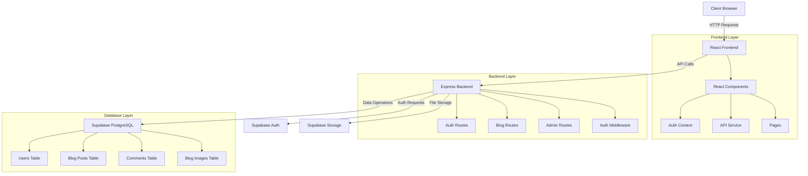

# RBAC Blog Application

A full-featured blog platform with role-based access control (RBAC) built with React, Node.js, Express, and Supabase.

## Architecture Overview


## admin
email-admin@admin.com
password - admin
## Application Routes

### Frontend Routes

| Route                | Component           | Access              | Description                                   |
|----------------------|---------------------|---------------------|-----------------------------------------------|
| `/`                  | BlogList            | Public              | Homepage with blog posts listing              |
| `/blog`              | BlogList            | Public              | Alternative route to blog listing             |
| `/blog/:id`          | BlogDetail          | Public              | View a specific blog post                     |
| `/login`             | Login               | Public              | Login page                                    |
| `/register`          | Register            | Public              | Registration page                             |
| `/forgot-password`   | ForgotPassword      | Public              | Password recovery                             |
| `/reset-password`    | ResetPassword       | Public              | Set new password with token                   |
| `/profile`           | Profile             | Authenticated       | User profile management                       |
| `/admin`             | AdminLayout         | Admin               | Admin panel redirect to dashboard             |
| `/admin/dashboard`   | Dashboard           | Admin               | Admin dashboard with statistics               |
| `/admin/users`       | UserManagement      | Admin               | Manage users and permissions                  |
| `/admin/posts`       | PostForm            | Admin               | Create and manage blog posts                  |
| `/admin/posts/:id`   | PostForm            | Admin               | Edit a specific blog post                     |

### Backend API Routes

| Method | Route                          | Middleware       | Description                               |
|--------|--------------------------------|------------------|-------------------------------------------|
| POST   | `/api/auth/login`              | -                | User login                                |
| POST   | `/api/auth/register`           | -                | User registration                         |
| GET    | `/api/auth/me`                 | `auth.verifyToken` | Get current user                        |
| POST   | `/api/auth/send-verification`  | -                | Send email verification                   |
| POST   | `/api/auth/reset-password`     | -                | Request password reset                    |
| POST   | `/api/auth/reset-password/confirm` | -            | Confirm password reset with token         |
| POST   | `/api/auth/logout`             | -                | User logout                               |
| POST   | `/api/auth/verify-token`       | -                | Verify authentication token               |
| GET    | `/api/blog`                    | -                | List blog posts                           |
| GET    | `/api/blog/:id`                | -                | Get a specific blog post                  |
| POST   | `/api/blog`                    | `auth.verifyToken` | Create a blog post                      |
| PUT    | `/api/blog/:id`                | `auth.verifyToken` | Update a blog post                      |
| DELETE | `/api/blog/:id`                | `auth.verifyToken` | Delete a blog post                      |
| POST   | `/api/blog/:id/comments`       | `auth.verifyToken` | Add a comment                           |
| GET    | `/api/admin/auth-check`        | `auth.verifyToken`, `roleAuth(['admin'])` | Verify admin access |
| GET    | `/api/admin/stats`             | `auth.verifyToken`, `roleAuth(['admin'])` | Get admin stats    |
| GET    | `/api/admin/users`             | `auth.verifyToken`, `roleAuth(['admin'])` | List all users     |
| PATCH  | `/api/admin/users/:id/role`    | `auth.verifyToken`, `roleAuth(['admin'])` | Update user role   |
| DELETE | `/api/admin/users/:id`         | `auth.verifyToken`, `roleAuth(['admin'])` | Delete a user      |
| GET    | `/api/admin/blog-posts`        | `auth.verifyToken`, `roleAuth(['admin'])` | Admin blog posts   |
| GET    | `/api/admin/blog-posts/:id/comments` | `auth.verifyToken`, `roleAuth(['admin'])` | Get post comments |
| DELETE | `/api/admin/comments/:id`      | `auth.verifyToken`, `roleAuth(['admin'])` | Delete a comment   |
| POST   | `/api/admin/make-admin`        | `auth.verifyToken`, `roleAuth(['admin'])` | Promote user to admin |

## Getting Started

### Prerequisites

- Node.js (v14 or higher)
- npm or yarn
- PostgreSQL database (via Supabase)
- Supabase account

### Environment Setup

1. Clone the repository:
   ```bash
   git clone https://github.com/hitankshah/rbac-blog-platform
   cd rbac-blog-platform
   ```

2. Set up backend environment variables:
   Create a `.env` file in the `backend` directory:
   ```
   # Supabase
   SUPABASE_URL=your_supabase_url
   SUPABASE_ANON_KEY=your_supabase_anon_key
   SUPABASE_JWT_SECRET=your_supabase_jwt_secret
   SUPABASE_STORAGE_URL=your_supabase_storage_url
   STORAGE_BUCKET=blog-images
   
   # App settings
   PORT=5000
   NODE_ENV=development
   SITE_URL=http://localhost:3000
   REDIRECT_URL=http://localhost:3000/auth/callback
   ```

3. Set up frontend environment variables:
   Create a `.env` file in the `frontend` directory:
   ```
   REACT_APP_API_URL=http://localhost:5000
   ```

### Database Setup

1. Create a new Supabase project
2. Execute the SQL schema found in `database/schema.sql` in your Supabase SQL editor
3. Enable storage and create a bucket named `blog-images`

### Installation and Running

1. Install backend dependencies:
   ```bash
   cd backend
   npm install
   npm start
   ```

2. Install frontend dependencies:
   ```bash
   cd frontend
   npm install
   npm start
   ```

3. Access the application:
   - Frontend: http://localhost:3000
   - Backend API: http://localhost:5000

### Creating an Admin User

1. Register a new user through the application
2. Use the SQL script in `database/make_admin.sql` to promote a user to admin:

   ```sql
   -- Replace with your user's email
   UPDATE public.users
   SET role = 'admin'
   WHERE email = 'admin@example.com';
   ```

## User Roles and Permissions

The application has two main roles:

1. **User**
   - Can view blog posts
   - Can create comments on blog posts
   - Can manage their own profile

2. **Admin**
   - All user permissions
   - Can create, edit, and delete blog posts
   - Can manage all user accounts
   - Can delete any comments
   - Can promote users to admin role

## Project Structure

```
rbac-blog/
├── backend/
│   ├── middleware/
│   │   ├── auth.js         # Authentication middleware
│   │   └── roleAuth.js     # Role-based authorization middleware
│   ├── routes/
│   │   ├── admin.js        # Admin-specific routes
│   │   ├── auth.js         # Authentication routes
│   │   └── blog.js         # Blog posts and comments routes
│   ├── .env                # Backend environment variables
│   ├── package.json        # Backend dependencies
│   └── server.js           # Express server entry point
├── frontend/
│   ├── public/             # Static assets
│   ├── src/
│   │   ├── components/
│   │   │   ├── admin/      # Admin panel components
│   │   │   ├── auth/       # Authentication components
│   │   │   ├── blog/       # Blog related components
│   │   │   ├── layout/     # Layout components
│   │   │   └── user/       # User profile components
│   │   ├── context/
│   │   │   └── AuthContext.js  # Authentication context provider
│   │   ├── services/
│   │   │   └── api.js      # API service for backend communication
│   │   ├── App.js          # Main application component
│   │   └── index.js        # React entry point
│   ├── .env                # Frontend environment variables
│   └── package.json        # Frontend dependencies
├── database/
│   ├── schema.sql          # Database schema
│   └── make_admin.sql      # SQL to create admin user
└── README.md               # Project documentation
```

## Technologies Used

- **Frontend**: React, React Router, Axios, Context API
- **Backend**: Node.js, Express
- **Database**: PostgreSQL (via Supabase)
- **Authentication**: Supabase Auth
- **Storage**: Supabase Storage
